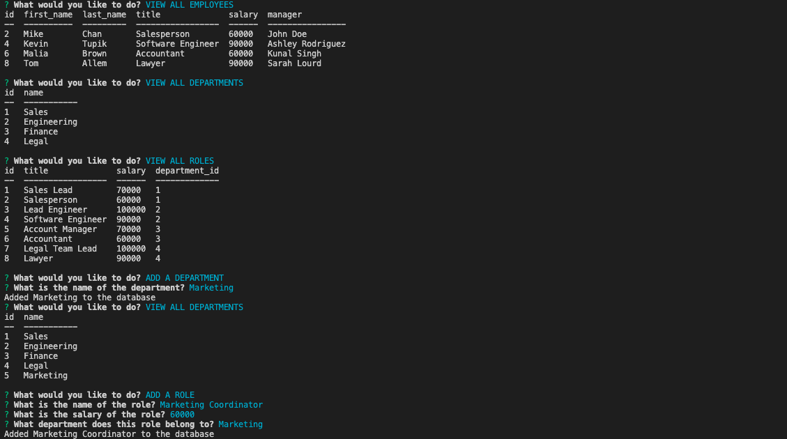

# Employee Tracker

[Walk-through Video](https://drive.google.com/file/d/1YIq84INNY4X15nOEDRkt355wZJJFy3yy/view?usp=sharing)

## Table of Contents
- [Description](#Description)
- [Usage](#Usage)
- [Visuals](#Visual)

## Description

The Employee Tracker application creates an easy and accessible way for a user to view various information from a workplace database. By simply choosing an option from the menu provided, a user has the ability to view all employees in the database, all departments, all roles--as well as the employee ids, salary, and managers. The user is also able to utilize this application to add new departments, roles, and employees, and even update an existing employee, too. Please watch the walk-through video via the link above to see the application in action.

## Usage

Type the following command to run this application:

```js
node server.js

```

## Visuals

